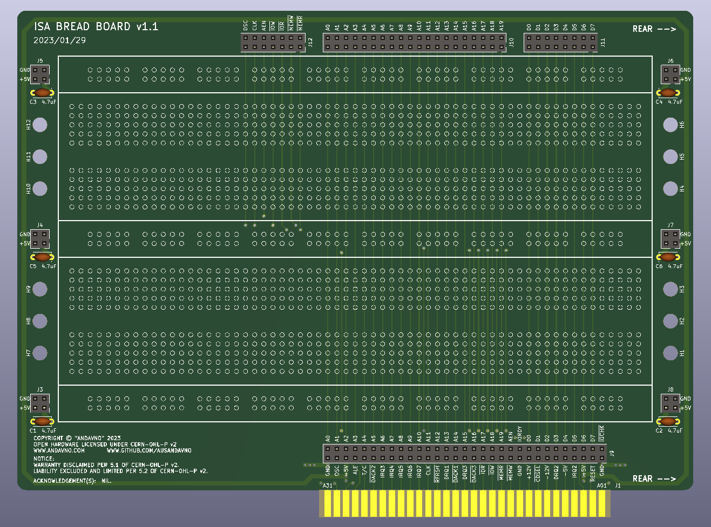
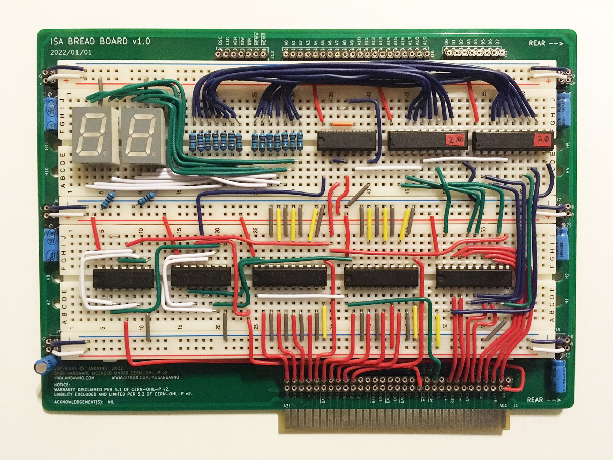

# ISA_Bread_Board_v1.1
Version 1.1 of a plug-in board designed to house breadboard components to allow easy prototyping on an 8-bit ISA data bus.

Board render:

Constructed board (older version; ignore version number):

## Hardware Documentation

### Schematic and PCB Layout

[Schematics - Version 5.1 (pdf)](../v1.1/Schematics/ISA_Bread_Board_v1.1-Schematics.pdf)

[PCB Layout - Version 1.1 (zip)](../v1.1/PCB_Layout/ISA_Bread_Board_v1.1-PCB_Layout.zip)

[Gerbers - Version 1.1 (zip)](../v1.1/Gerbers/ISA_Bread_Board_v1-1-Gerbers.zip)

### Breadboard Components

Designed to house breadboard modules of "standard" size:
* Main Module:
  * 10 Columns, 63 Rows
  * 35.56mm wide (excluding interconnect lugs), 165.1mm long
* Power Rail Module:
  * 9.525mm wide (excluding interconnect lugs), 165.1mm long  

Designed to house two main modules and three power rails on each side of the pcb, if desired.

Absolute maximum board area in which to stick breadboard modules is 103.63mm wide by 167.26mm long.

### Bill of Materials - v1.1

Component type     | Reference | Description            | Quantity | Possible sources and notes 
------------------ | --------- | ---------------------- | -------- | --------------------------
PCB                |           | ISA Post Card v1.1     | 1        | Use supplied Gerber or KiCad files to order from your perferred PCB fabrication house
Breadboard |         | Choose to your preference. Up to two main modules and three power rails. Suggested Mouser part has not been tested. Suggested to purchase two Mouser units and discard one of the power rails.|          | Mouser [BB830](https://au.mouser.com/ProductDetail/854-BB830)
Capacitor   | C1 - C6  | P5.08mm 4.7uF 25V  | 6        | Mouser [FG28X5R1E475KRT00](https://au.mouser.com/ProductDetail/810-FG28X5R1E475KRT0)
Header | J3-J8    | Female Header 02x02   | 6        | Use 1x40 female turned pin strip (2.54mm Pitch) or specific header
Header | J9    | Female Header 02x31   | 1        | Use 1x40 female turned pin strip (2.54mm Pitch) or specific header
Header | J10    | Female Header 02x20   | 1        | Use 1x40 female turned pin strip (2.54mm Pitch) or specific header
Header | J11    | Female Header 02x08   | 1        | Use 1x40 female turned pin strip (2.54mm Pitch) or specific header
Header | J12    | Female Header 02x07   | 1        | Use 1x40 female turned pin strip (2.54mm Pitch) or specific header

## Changes
* Version 1.1
  * First Issue

## Known Issues
* Version 1.1
  * None at present
 
## Open Hardware License
 
You may redistribute and modify this Covered Source, and make products using it, under the terms of the CERN-OHL-P v2 (https:/cern.ch/cern-ohl). This Covered Source is distributed WITHOUT ANY EXPRESS OR IMPLIED WARRANTY, INCLUDING OF MERCHANTABILITY, SATISFACTORY QUALITY AND FITNESS FOR A PARTICULAR PURPOSE. Please see the CERN-OHL-P v2 for applicable conditions.
 
Warranty Disclaimed per 5.1 of CERN-OHL-P v2.
 
Liability Excluded and Limited per 5.2 of CERN-OHL-P v2.
 
See "LICENSE_NOTICES_and_CHANGES.txt" for specific Notices relating to this hardware design.
